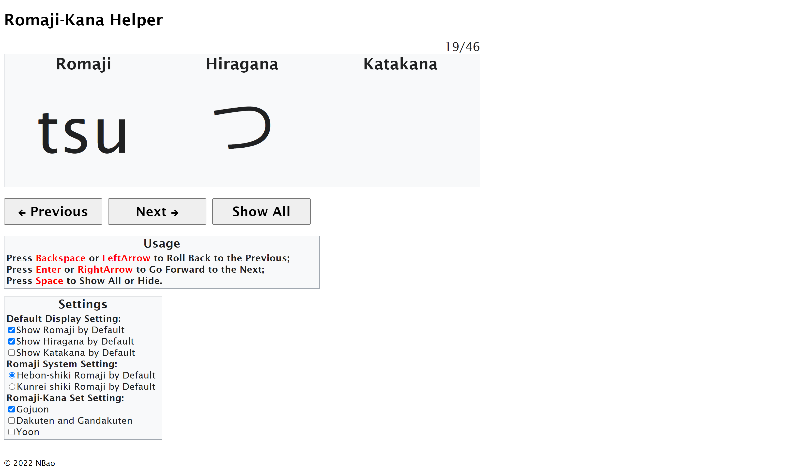

# Romaji-Kana Helper
**A Helper for Memorizing Kanas with Romajis.**

## Introduction

This project can help you memorize Japanese Kanas by randomly show each Kana with Romaji. By changing the settings, you can decide to show Romajis with correspond Hiraganas and Katakanas, or just show Romajis alone to test your memorizing achievement by write Kanas down. Also, you can change the Romaji Systems, whether Hebon-shiki Romaji System or Kunrei-shiki Romaji System. Additionally, you can choose any different combinations by selecting different Romaji-Kana set, for example, standard Gojūon, Dakuon/Handakuon, or Yōon.

## Usage

Press **Backspace** or **LeftArrow** to Roll Back to the Previous;

Press **Enter** or **RightArrow** to Go Forward to the Next;

Press **Space** to Show All or Hide.

